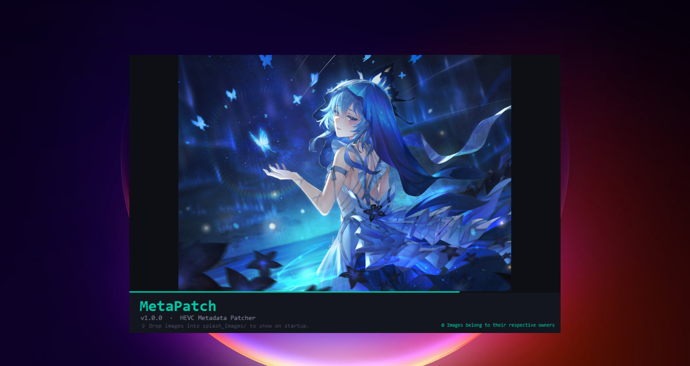
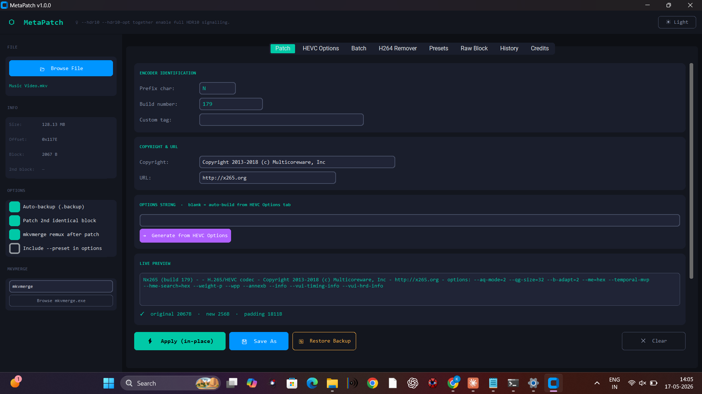
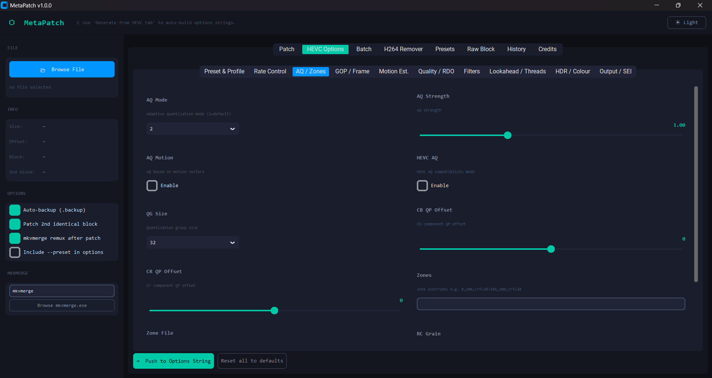
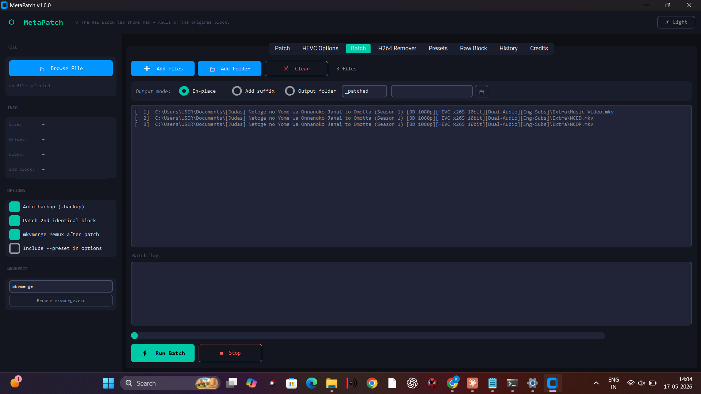
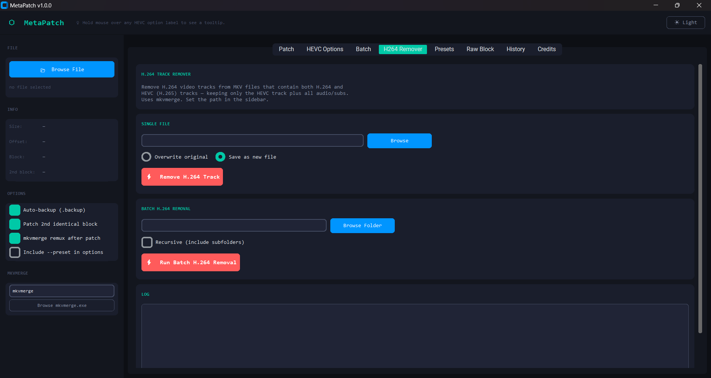
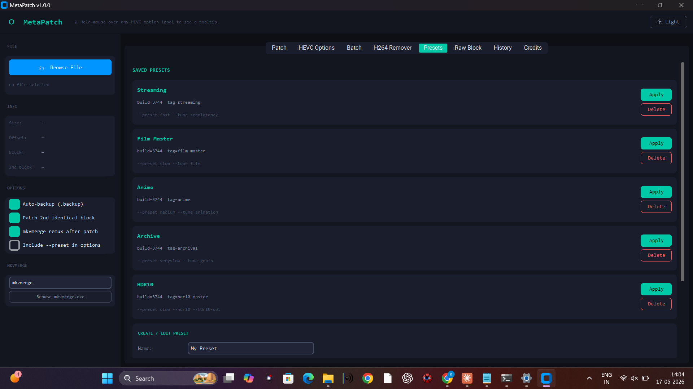
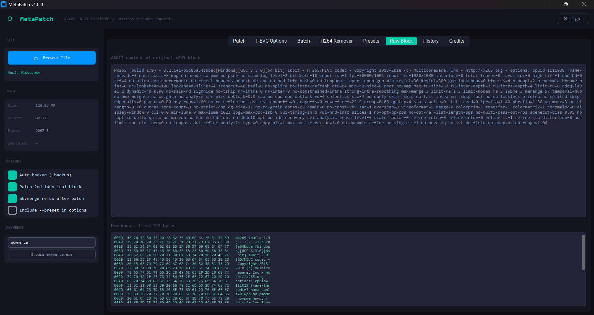

# MetaPatch v1.0

**HEVC/x265 Metadata Patcher** — A GUI tool to patch x265 encoder strings in MKV/MP4 files, build HEVC option strings wihout and with remux both, remux via mkvmerge, and more features.

---

## Screenshots

---

## Features
- x265 encoder string patching (single & batch)
- Full HEVC options builder with 100+ parameters
- mkvmerge remux pass(For CR32 Fix)
- H.264 track remover
- Custom preset maker
- Animated splash screen
- Light / Dark theme
- Patch history (all 100+ options)

---

## Requirements
- Python 3.10+
- mkvmerge (optional, for remux features)

---

## Run from Source
pip install customtkinter Pillow
python metapatch.py

---

## Download
[**Latest Release →**](../../releases/latest)

---

## Splash Images
Drop your own images into splash_images/ folder — MetaPatch picks one randomly on startup!
Supported formats: JPG, PNG, WEBP

---

## Image Credits
Splash screen wallpapers sourced from various sites.
See [images_credit.txt](images_credit.txt) for full credits.
All wallpapers belong to their respective artists/owners.

---

## License
MIT License — see LICENSE
Software only. Wallpaper images are not covered by this license.
